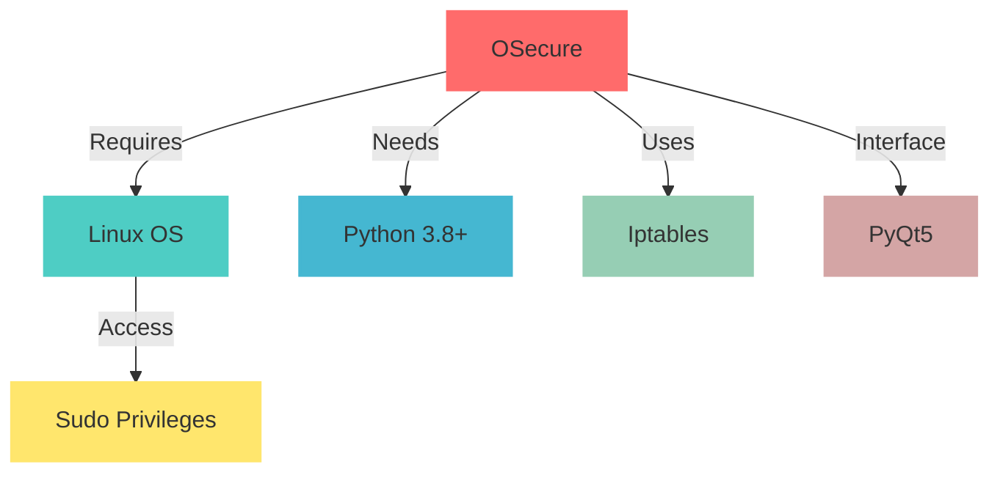

<div align="center">

# 🛡️ OSecure
### Open Source Secure Firewall

[](https://www.linux.org/)
[](https://www.python.org/)
[](https://www.netfilter.org/)
[](LICENSE)
[](https://www.qt.io/)

*A modern, intuitive GUI application for comprehensive Linux firewall management*

[📘 Documentation](docs) | [💻 Installation](#-installation) | [🐛 Report Bug](issues) | [✨ Request Feature](issues)


</div>

## 📋 Table of Contents
- [Overview](#-overview)
- [Features](#-features)
- [Requirements](#-requirements)
- [Installation](#-installation)
- [Usage Guide](#-usage-guide)
- [Security Features](#-security-features)
- [Troubleshooting](#-troubleshooting)
- [Contributing](#-contributing)

## 🌟 Overview

OSecure provides a user-friendly graphical interface for managing Linux firewall rules through iptables. It combines powerful security features with an intuitive interface, making firewall management accessible to both beginners and advanced users.

## ✨ Features

| Category | Features | Description |
|----------|----------|-------------|
| 🛡️ Core Protection | Firewall Rules<br>Port Management<br>Service Control | Basic firewall functionality with comprehensive rule management |
| 📊 Monitoring | Real-time Status<br>Traffic Analysis<br>Rule Tracking | Live system monitoring and traffic visualization |
| 🌍 Geo-Filtering | Country Blocking<br>Region Rules<br>IP Range Management | Geographic-based access control and filtering |
| 🔒 DDoS Protection | Rate Limiting<br>Connection Tracking<br>Flood Protection | Advanced DDoS mitigation techniques |
| 📱 Application Security | Layer 7 Filtering<br>Deep Packet Inspection<br>Protocol Analysis | Application-level traffic control and security |
| 📝 Logging | System Events<br>Security Alerts<br>Rule Changes | Comprehensive logging and alerting system |

## ⚙️ Requirements

### System Requirements



### Software Dependencies
- Linux Operating System
- Python 3.8 or higher
- Iptables (pre-installed on most Linux distributions)
- PyQt5 GUI framework
- Root/sudo privileges for firewall management

## 💻 Installation

1. **Clone Repository**
   ```bash
   git clone https://github.com/Kentox493/OSecure.git
   cd OSecure
   ```

2. **Create Virtual Environment** (Recommended)
   ```bash
   python -m venv venv
   source venv/bin/activate  # Linux/Mac
   ```

3. **Install Dependencies**
   ```bash
   pip install -r requirements.txt
   ```

4. **Launch Application**
   ```bash
   sudo python gui.py
   ```

## 🚀 Usage Guide

### Main Interface
<div align="center">

</div>

### Key Functions

| Section | Description | Access |
|---------|-------------|---------|
| Rule Management | Add, edit, and remove firewall rules | Rules Tab |
| Status Monitor | View current firewall status | Status Tab |
| Geo-Filtering | Manage geographic restrictions | Geo Tab |
| Logs Viewer | Monitor system and security logs | Logs Tab |
| Settings | Configure application preferences | Settings Menu |

### Quick Start Steps

1. **Launch Application**
   ```bash
   sudo python gui.py
   ```

2. **Basic Configuration**
   - Enable basic protection
   - Configure network services
   - Set up logging preferences

3. **Advanced Setup**
   - Configure DDoS protection
   - Set up geographic filtering
   - Enable application layer security

## 🔒 Security Features

### Core Protection

| Feature | Description | Configuration |
|---------|-------------|---------------|
| Basic Rules | Essential firewall rules | Auto-configured |
| Network Protection | Service-specific protection | Services tab |
| SSH Security | Secure shell protection | SSH tab |
| DDoS Mitigation | Anti-DDoS measures | Security tab |

### Advanced Security

<details>
<summary>Geographic Filtering</summary>

- Country-based blocking
- Region-specific rules
- IP range management
- Custom geolocation rules
</details>

<details>
<summary>Application Security</summary>

- Deep packet inspection
- Protocol verification
- Application fingerprinting
- Behavioral analysis
</details>

## 🔧 Troubleshooting

### Common Issues

| Issue | Solution | Prevention |
|-------|----------|------------|
| Rule Conflicts | Use rule analyzer | Regular rule audit |
| Performance Impact | Enable optimization | Monitor system resources |
| Connection Issues | Check logs | Test rules before applying |

### Log Analysis

```bash
# View system logs
sudo tail -f /var/log/osecure/system.log

# Check security alerts
sudo cat /var/log/osecure/security.log
```

## 🤝 Contributing

We welcome contributions! Here's how you can help:

1. Fork the repository
2. Create your feature branch (`git checkout -b feature/AmazingFeature`)
3. Commit your changes (`git commit -m 'Add AmazingFeature'`)
4. Push to the branch (`git push origin feature/AmazingFeature`)
5. Open a Pull Request

### Development Setup

```bash
# Setup development environment
git clone https://github.com/Kentox493/OSecure.git
cd OSecure
python -m venv venv
source venv/bin/activate
pip install -r requirements-dev.txt
```

## 📝 License

This project is licensed under the MIT License - see the [LICENSE](LICENSE) file for details.

## 👏 Acknowledgments

- Built with [PyQt5](https://www.riverbankcomputing.com/software/pyqt/)
- Powered by [iptables](https://www.netfilter.org/)
- Icons by [FontAwesome](https://fontawesome.com/)

---

<div align="center">

Made with ❤️ by [Kentox493](https://github.com/Kentox493)

[🔝 Back to top](#-table-of-contents)

</div>
